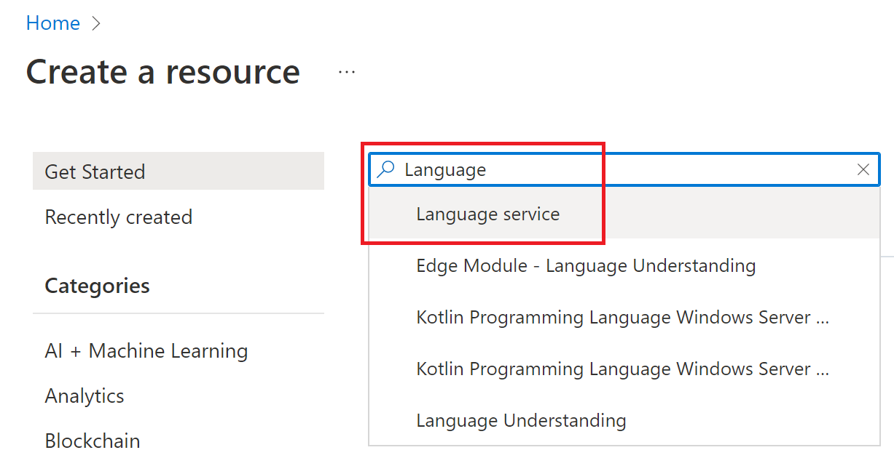
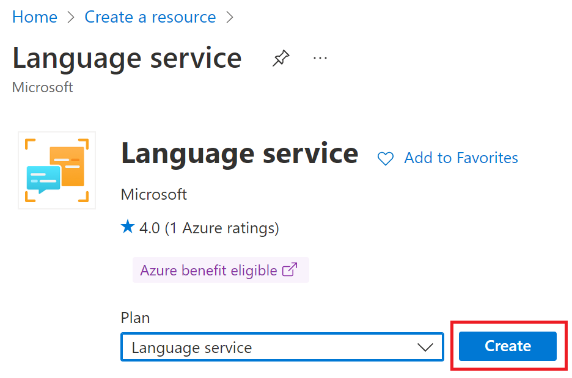
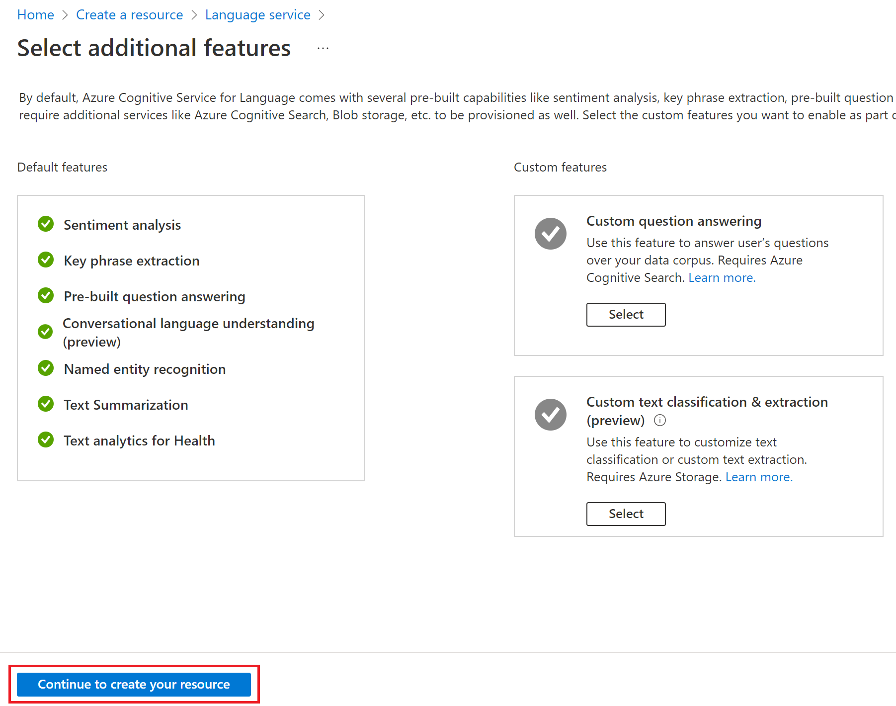
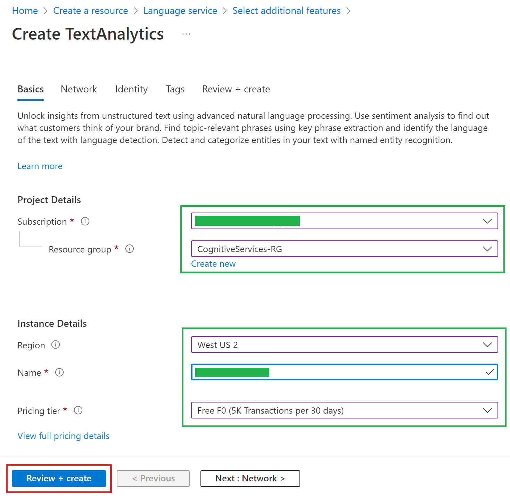
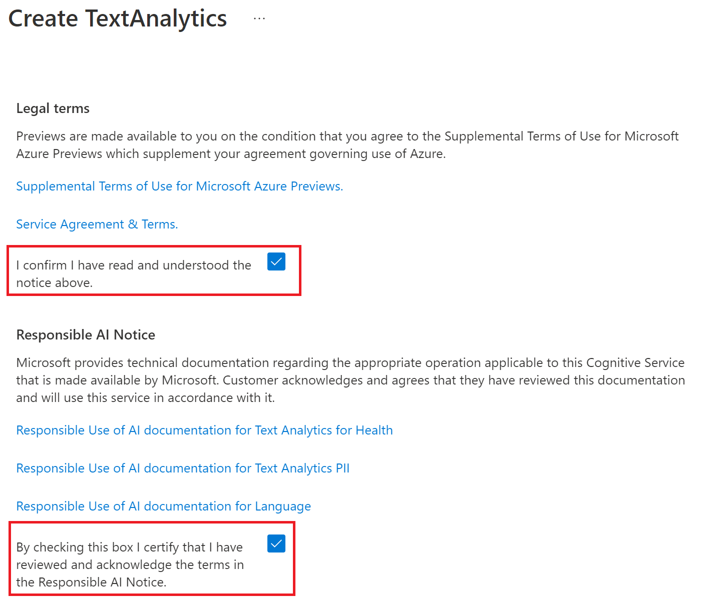
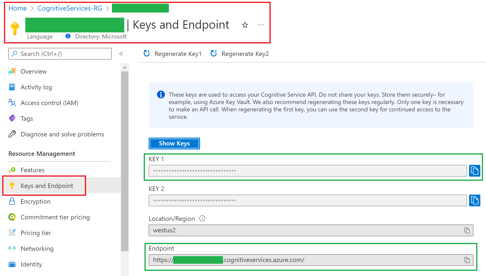

# Azure Health Bot: Consuming Cognitive Services Demo

## Introduction

We need to perform following tasks to successfully call any API from Health Bot.

- An API you would like to consume. You can consume someone else's API or an API developed for you as well. We will consume Azure [Cognitive Services TextAnalytics](https://docs.microsoft.com/rest/api/cognitiveservices-textanalytics/3.1/analyze) or [preview link](https://docs.microsoft.com/rest/api/cognitiveservices-textanalytics/3.1preview4/analyze) and [Question Answering](https://docs.microsoft.com/rest/api/cognitiveservices/questionanswering/question-answering/get-answers) APIs.
- Azure Health Bot from which we'll consume APIs. We will create data connection to consume following APIs:
  - Entity Recognition,
  - Entity Linking,
  - Recognize PII,
  - Key Phrase Extraction,
  - Sentiment Analysis,
  - Language Detection,
  - Answer Questions (Static) - using question embedded in the API call,
  - Answer Questions (Dynamic) - by passing user supplied question to the API call.

  > **Note**  
  > - The first six services are part of [Azure Language Service](https://docs.microsoft.com/azure/cognitive-services/language-service/)
  > - The last two  are part of [Azure Question Answering service](https://docs.microsoft.com/azure/cognitive-services/language-service/question-answering/overview).

### Create Language Studio instance in Azure

- [Quickstart: Get started with Language Studio](https://docs.microsoft.com/azure/cognitive-services/language-service/language-studio)

### Create Question Answering instance in Azure

- [Quickstart: question answering](https://docs.microsoft.com/azure/cognitive-services/language-service/question-answering/quickstart/sdk?pivots=studio)
- For step #10, use the following urls instead of *Surface Book User Guide*.
  - Azure Cognitive Search FAQ: [https://docs.microsoft.com/azure/search/search-faq-frequently-asked-questions](https://docs.microsoft.com/azure/search/search-faq-frequently-asked-questions)
  - **[Optional]** FAQ for Azure Cognitive Services containers: [https://docs.microsoft.com/azure/cognitive-services/containers/container-faq](https://docs.microsoft.com/azure/cognitive-services/containers/container-faq)
  - **[Optional]** FAQ for Azure Cognitive Services disconnected containers: [https://docs.microsoft.com/azure/cognitive-services/containers/disconnected-container-faq](https://docs.microsoft.com/azure/cognitive-services/containers/disconnected-container-faq)

### Create Azure Health Bot in Azure

Go through these steps to get familiar with the Azure Health Bot:

- [Create your first Health Bot](https://docs.microsoft.com/azure/health-bot/quickstart-createyourhealthcarebot)
- [Experience a built-in Health Bot conversation](https://docs.microsoft.com/azure/health-bot/quickstart-experiencebuiltinconveration)
- [Author your first Health Bot scenario Quickstart](https://docs.microsoft.com/azure/health-bot/quickstart-createyourfirstscenario)

Now, you should be familiar with the Health Bot. You should be able to create custom scenarios by adding prompt, statements etc. This is nothing but a workflow based IDE (Integrated Development Environment) where you can execute code behind the scenes without writing any!
  
### Create Language Service (Text Analytics) instance

- Login to [Azure Portal](https://portal.azure.com)

- Create a **New** resource.  
  

- Select **Language Service** resource.  
  

- Select *Language Service* features as desired. For demo, select all.  
  

- Supply required subscription, resource group, region, pricing details and name for your resource. For demo, Free tier is sufficient.  
  

- You can supply additional details in **Network**, **Identity** and **Tags** screen if needed.

- Before you click on **Review + create**, you need to accept Microsoft's Responsible AI terms and conditions. Click [Microsoft Responsible AI principles in practice](https://www.microsoft.com/ai/responsible-ai) for more details. You can also review service agreements on the **Review + create** page.  
  

### Language Service TextAnalytics Configurations

Now, let's save a couple of the key settings we'll need for our demo. They are

  - [Subscription Key](https://docs.microsoft.com/azure/cognitive-services/authentication?tabs=powershell#authenticate-with-a-single-service-subscription-key): We will use this option to authenticate API calls. For production choose sophisticated authentications like AAD or equivalent authentication mechanism.
  
  - Endpoint url: The service url for making API call.  
  
  
  
  > **Note:**
  > Save *subscription Key* and *Endpoint Url* in notepad for later use.

### Next

[Import sample to Azure Health Bot](./HealthBot.md)
