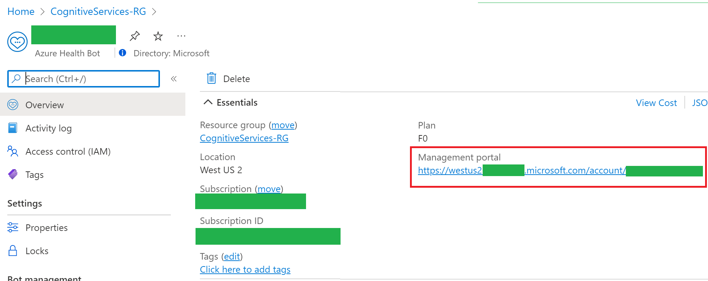
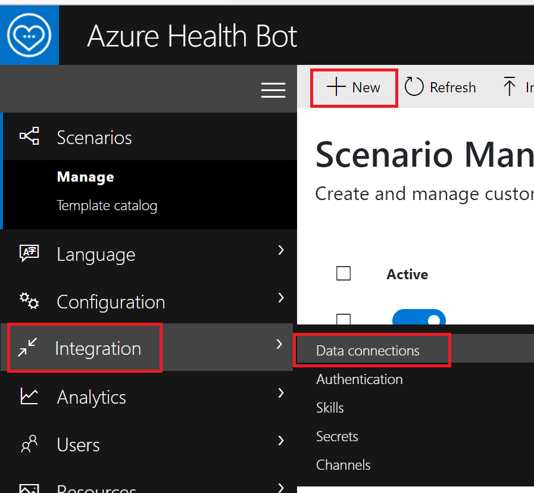
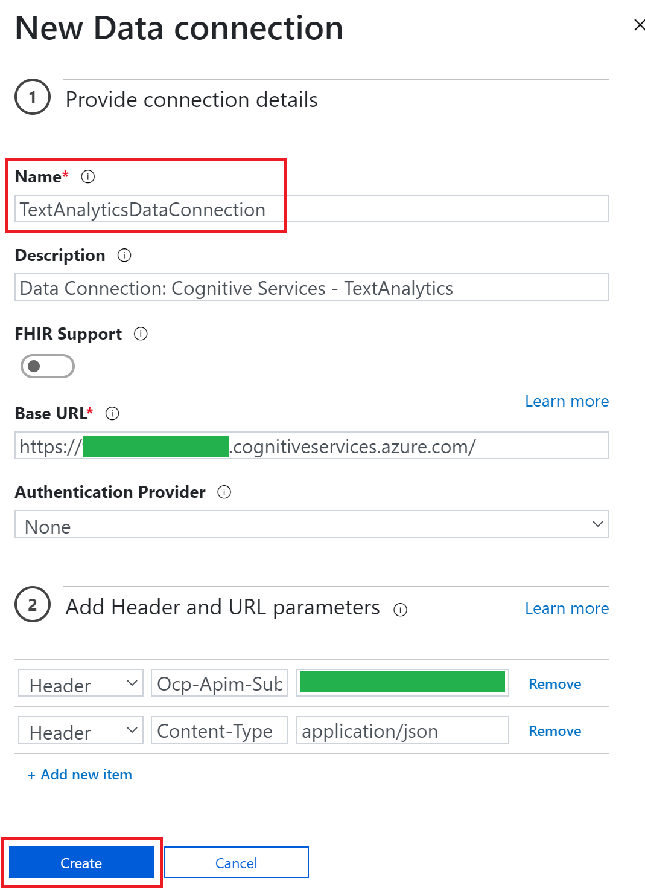
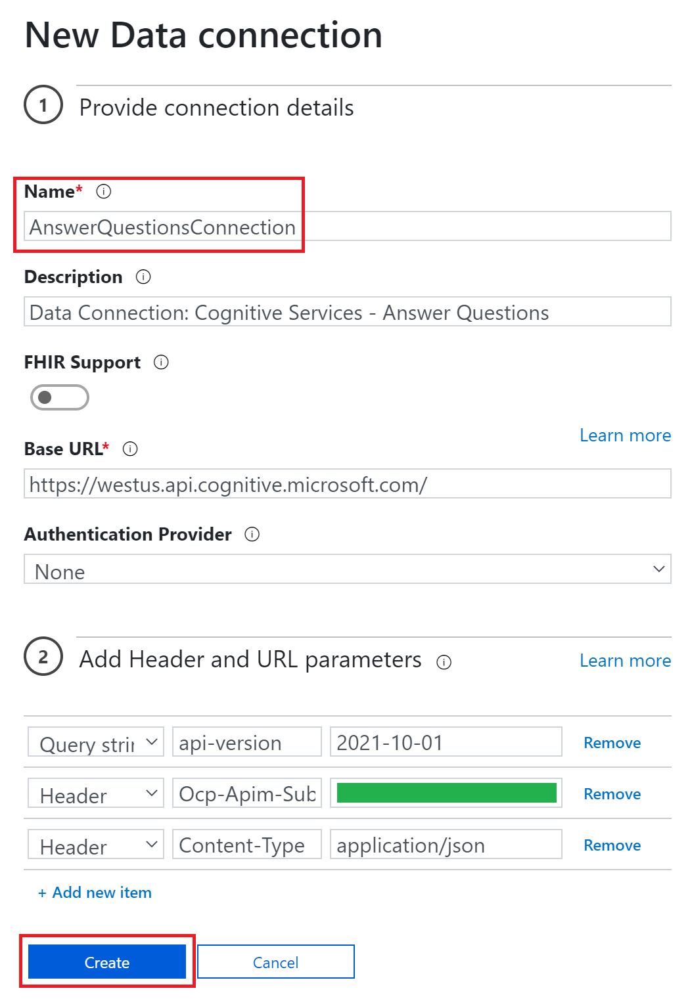
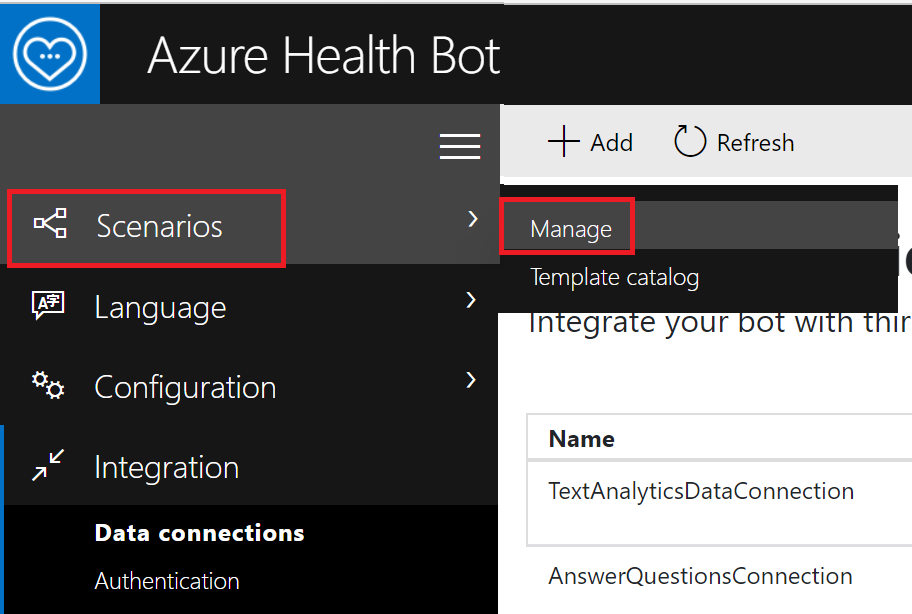
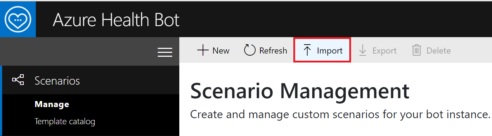
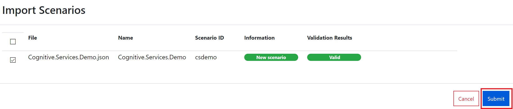
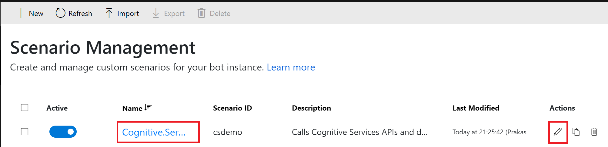
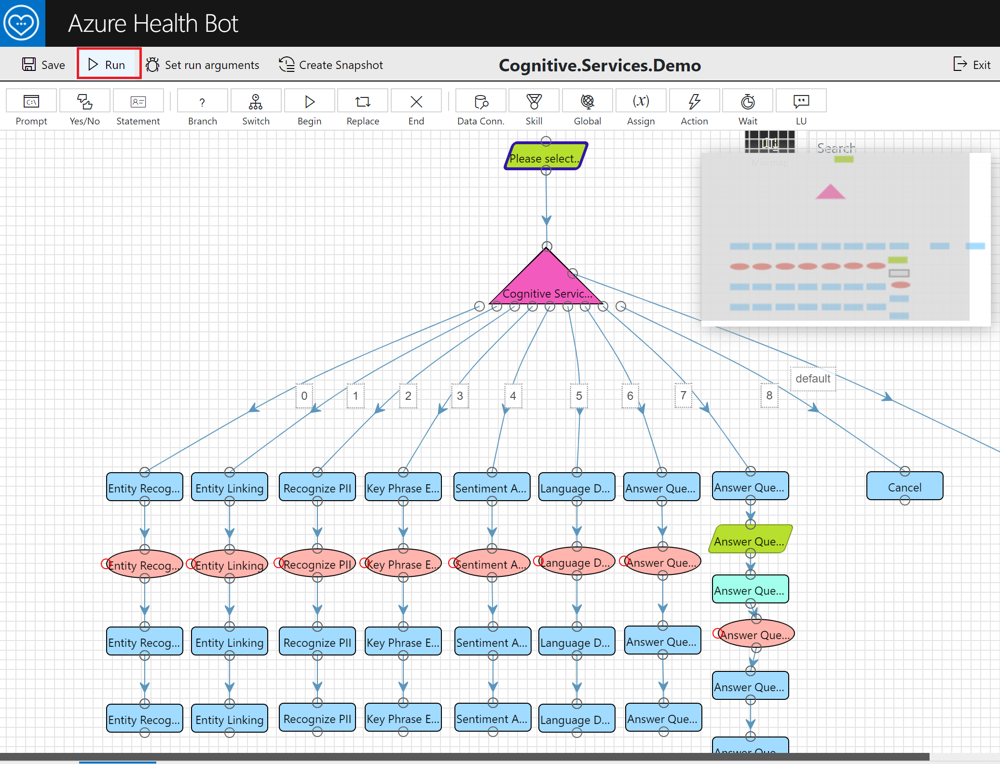
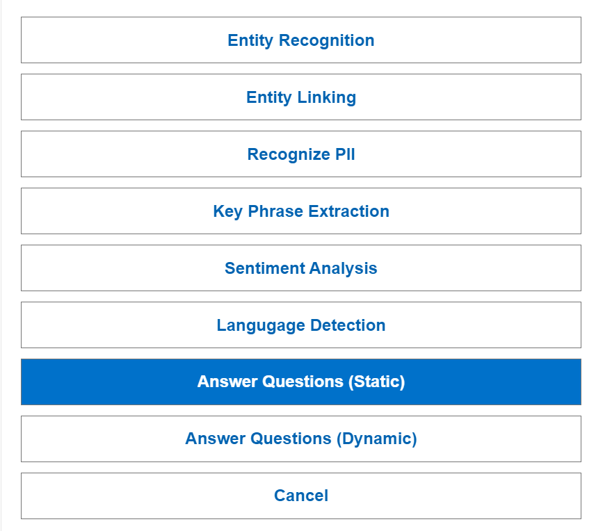

# Azure Health Bot: Consuming Cognitive Services Demo

## Introduction

We need to perform following tasks to successfully call any API using Health Bot.

### Import sample to Azure Health Bot

- Download `Cognitive.Services.Demo.json` file from GitHub repo, if you haven't already.

- Find / Replace all occurrences of `https://azure_language_service_textanalytics_resource_name.cognitiveservices.azure.com/` with the **TextAnalytics Endpoint Url**. We saved it in the last step of previous section.

- After replacing, don't forget to **Save** the file `Cognitive.Services.Demo.json`.

- If needed, login to [Azure Portal](https://portla.azure.com).

- Navigate to Azure Health Bot resource you created earlier. Click on url under *Management portal*.
  

- Select **Integration > Data connections** on the blade. Click on **New** to create a new data connection.
  

  > **Note:**
  > Make names of the data connection services in the file `Cognitive.Services.Demo.json` and portal match with what you had used earlier.
  > It is recommended that you use same name as demo and modify it later to avoid running into any issues during import.

- Specify following values:
  

  | **Title** | **Comments** |
  | --------- | -------------|
  | **Name** | Pick a convenient name for data connection API (`TextAnalyticsDataConnection`) |
  | **Description** | Description about data connection |
  | **Base URL** | The **TextAnalytics Endpoint Url** we saved earlier. |
  | **Authentication Provider** | It is highly recommended that you choose Authentication providers like Azure Active Directory. For demo purposes select **None**. |
  | **Add Header and URL parameters** | We will add following headers |
  | **`Ocp-Apim-Subscription-Key`** | The **TextAnalytics Key** we saved earlier. |
  | **`Content-Type`** | `application/json` |
  ------------ ---------------

  Here is a screenshot of **TextAnalytics** Subscription Key and Endpoitn Url.
  

- Create one more data connection for calling **Answer Questions** APIs.
  

  | **Title** | **Comments** |
  | --------- | -------------|
  | **Name** | Pick a convenient name for data connection API (`AnswerQuestionsConnection`) |
  | **Description** | Description about data connection |
  | **Base URL** | The **TextAnalytics Endpoint Url** we saved earlier. |
  | **Authentication Provider** | It is highly recommended that you choose Authentication providers like Azure Active Directory. For demo purposes select **None**. |
  | **Add Header and URL parameters** | We will add following headers |
  | **`api-version`** | `2021-10-01` |
  | **`Ocp-Apim-Subscription-Key`** | The **TextAnalytics Key** we saved earlier. |
  | **`Content-Type`** | `application/json` |
  ------------ ---------------

- Now, we are ready to create a scenario that can consume the APIs we created.
  

- Click on **Import** button to import demo scenario to Azure Health Bot.
  

- Select the file `Cognitive.Services.Demo.json` you downloaded earlier. There should not be any errors but fix error(s) if required. Click on **Submit** to *Import Scenario*.
  

- Let's edit the scenario we imported.
  

- Click on **Run** button to run various scenarios.
  

- List of scenarios:
  
