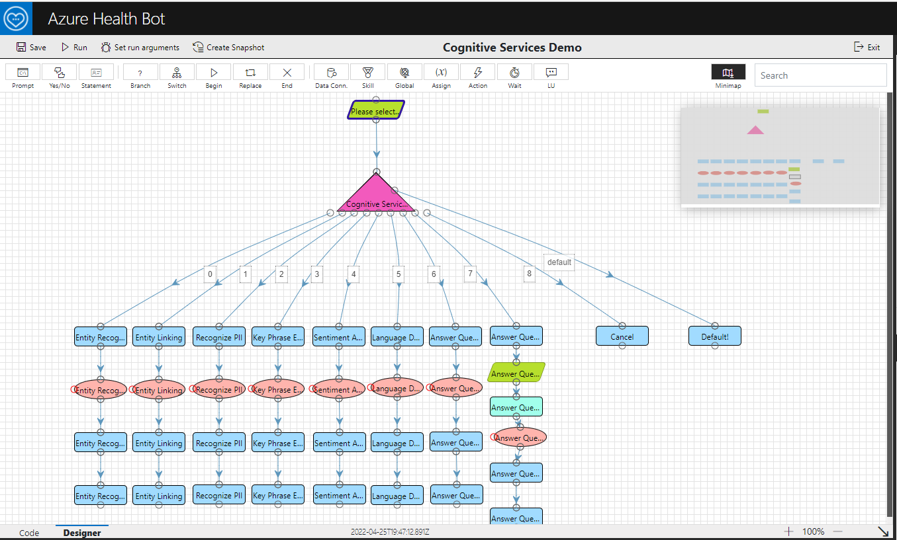

# Azure Health Bot: Consuming Cognitive Services Demo

## Introduction

This article can be used to consume any API from Azure Health Bot. It is very powerful feature that you may want to add it to your arsenal! You can create powerful Health Bot without writing zero or very little code!!

To dive directly into setup and sample, click on [Configuration](./Configuration.md)

## Consume Cognitive Services from a Health Bot

This sample demonstrates how to consume Azure Cognitive Services, namely Text Analytics and Answer Questions, from a Azure Health Bot. Here is how the final sample looks like after development.

## What is Azure Health Bot Service?

The Health Bot Service is a cloud platform that empowers developers in Healthcare organizations to build and deploy their compliant, AI-powered virtual health assistants and health bots, that help them improve processes and reduce costs. It allows you to offer your users intelligent and personalized access to health-related information and interactions through a natural conversation experience.

For additional information visit [Health Bot Overview](https://docs.microsoft.com/azure/health-bot/overview#what-is-the-microsoft-health-bot-service).

## What are Azure Cognitive Services?

Azure Cognitive Services are cloud-based artificial intelligence (AI) services that help you build cognitive intelligence into your applications. They are available as REST APIs, client library SDKs, and user interfaces. You can add cognitive features to your applications without having AI or data science skills. Cognitive Services enable you to build cognitive solutions that can see, hear, speak, understand, and even make decisions. The main four pillars are: **Vision**, **Speech**, **Language** and **Decision**.

In this demo, we are only consuming **Language** component but you can easily modify the sample to consume additional services.

For additional information visit [What are Azure Cognitive Services?](https://docs.microsoft.com/azure/cognitive-services/what-are-cognitive-services)

## What is Question Answering?

Question answering provides cloud-based Natural Language Processing (NLP) that allows you to create a natural conversational layer over your data. It is used to find the most appropriate answer for any input from your custom knowledge base (KB) of information.

Question answering is commonly used to build conversational client applications, which include social media applications, chat bots, and speech-enabled desktop applications. Several new features have been added including enhanced relevance using a deep learning ranker, precise answers, and end-to-end region support.

### [When should I use Question Answering?](https://docs.microsoft.com/azure/cognitive-services/language-service/question-answering/overview#when-to-use-question-answering)

- **When you have static information** - Use question answering when you have static information in your knowledge base of answers. This knowledge base is custom to your needs, which you've built with documents such as PDFs and URLs.
- **When you want to provide the same answer to a request, question, or command** - when different users submit the same question, the same answer is returned.
- **When you want to filter static information based on meta-information** - add metadata tags to provide additional filtering options relevant to your client application's users and the information. Common metadata information includes chit-chat, content type or format, content purpose, and content freshness.
- **When you want to manage a bot conversation that includes static information** - your knowledge base takes a user's conversational text or command and answers it. If the answer is part of a pre-determined conversation flow, represented in your knowledge base with multi-turn context, the bot can easily provide this flow.

### Why should I use Question Answering instead of QnA Maker?

- It will eventually replace Azure QnA Maker - [Azure QnA Maker will be retired on 31 March 2025](https://azure.microsoft.com/updates/azure-qna-maker-will-be-retired-on-31-march-2025/).

- It is a high time that you start consuming [Question Answering](https://docs.microsoft.com/azure/cognitive-services/language-service/question-answering/overview) instead of [Azure QnA Maker](https://docs.microsoft.com/azure/cognitive-services/QnAMaker/).

- The article will be rewritten soon with a support for Question Answering instead of QnA Maker: [Use QnA Maker to answer questions](https://docs.microsoft.com/azure/bot-service/bot-builder-howto-qna)

- [Migrating to Azure Cognitive Service for Language](https://docs.microsoft.com/azure/cognitive-services/language-service/concepts/migrate)

Click on [Configuration](./Configuration.md) to continue.
